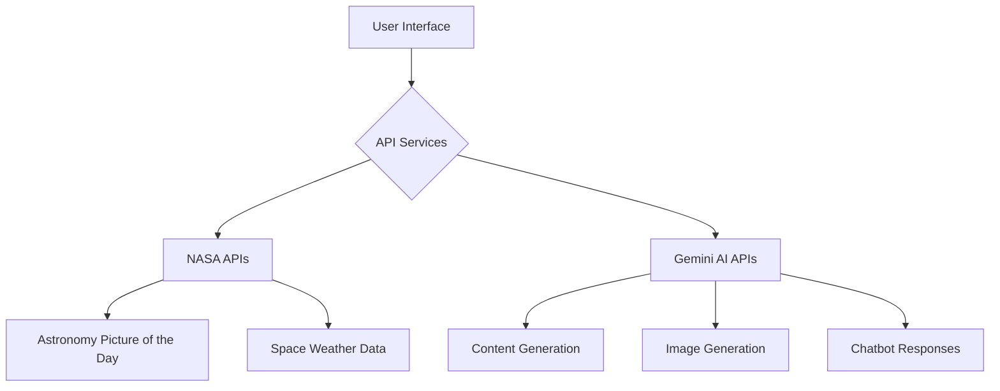
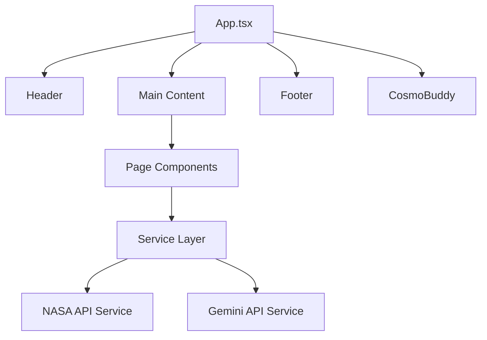

# CosmoConnect Architecture

## Data Flow Diagram

## API Integration Details

### NASA APIs

1. **Astronomy Picture of the Day (APOD)**
   - Endpoint: `https://api.nasa.gov/planetary/apod`
   - Purpose: Fetch daily space images and information
   - Service: `spaceWeatherService.ts`

2. **Coronal Mass Ejection (CME) Data**
   - Endpoint: `https://api.nasa.gov/DONKI/CME`
   - Purpose: Real-time space weather monitoring
   - Service: `spaceWeatherService.ts`

### Google Gemini AI

1. **Content Generation**
   - Models: `gemini-2.5-flash`
   - Purpose: Generate stories, educational content, and responses
   - Service: `geminiService.ts`

2. **Image Generation**
   - Models: `imagen-4.0-generate-001`
   - Purpose: Create coloring pages and visual content
   - Service: `geminiService.ts`

## Component Architecture

## Error Handling

The application implements comprehensive error handling:

1. **API Failures**: Graceful fallbacks with user-friendly messages
2. **Rate Limiting**: Automatic retry mechanisms and cache usage
3. **Network Issues**: Offline support with cached data
4. **Loading States**: Visual feedback during data fetching

## Data Caching

- APOD data is cached in sessionStorage for improved performance
- Frequently accessed content is cached to reduce API calls